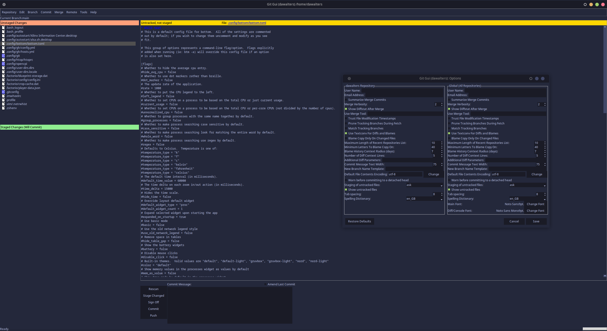

# Tokyonight for [git-gui](https://github.com/prati0100/git-gui)

> A dark theme for [git-gui](https://github.com/prati0100/git-gui).

Note: This screenshot is slightly outdated.

## Install

TBD.

## Issues

TBD.

## Inspiration

- [Tokyonight theme for `vscode`](https://github.com/enkia/tokyo-night-vscode-theme)
- [Tokyonight theme for `neovim`](https://github.com/folke/tokyonight.nvim)
- [Discussion on the git-gui repository](https://github.com/prati0100/git-gui/issues/64)

## License

[MIT License](./LICENSE)
